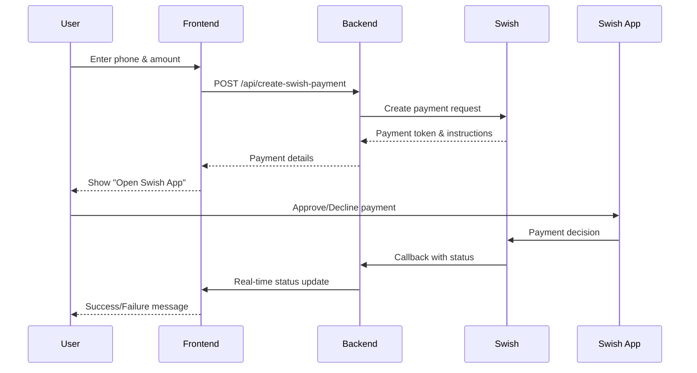

# 🇸🇪 Swish Payment Integration

A complete full-stack application for integrating Swedish Swish payments with real-time callbacks, featuring a React frontend and Node.js backend deployed on Vercel.

## 🚀 Live Demo

- **Production URL**: [https://swish-payment-oysi9ew1s-shamroz-warraichs-projects.vercel.app](https://swish-payment-oysi9ew1s-shamroz-warraichs-projects.vercel.app)
- **Health Check**: [/health](https://swish-payment-oysi9ew1s-shamroz-warraichs-projects.vercel.app/health)
- **Real-time Callbacks**: Instant payment status updates via Swish API webhooks

## 🔄 Recent Updates (July 2025)

### ✅ **Certificate Handling Improvements**

- Fixed PEM format issues by converting Buffer to UTF-8 string
- Enhanced error logging for certificate loading failures
- Added comprehensive environment variable validation

### ✅ **Deployment Enhancements**

- Resolved Vercel authentication protection issues
- Created fresh deployment without authentication screens
- Cleaned up environment variable conflicts in `vercel.json`

### ✅ **API Reliability**

- Added API availability checks before processing payments
- Enhanced error handling for production deployment
- Improved startup logging for debugging certificate issues

## ✨ Features

- ⚡ **Real-time Payment Updates**: No polling delays - instant status via Swish callbacks
- 🎨 **Modern React Frontend**: Responsive payment form with real-time status updates
- 🔒 **Secure Backend**: TLS certificate authentication with Swish production API
- 🌐 **Serverless Deployment**: Auto-deploying Vercel integration with GitHub
- 📱 **Mobile Optimized**: Works seamlessly with Swish mobile app
- 🔄 **Complete Payment Flow**: From initiation to completion with proper error handling
- 🛡️ **Production Ready**: Environment-aware certificate handling (local vs production)

## 🏗️ Tech Stack

- **Frontend**: React 18.2.0, Axios, CSS3
- **Backend**: Node.js, Express, HTTPS client with TLS certificates
- **Deployment**: Vercel (Serverless functions)
- **Payment API**: Swish Production API (cpc.getswish.net)
- **Security**: TLS certificate authentication, environment variables

## 📋 Prerequisites

- Node.js (v18 or higher)
- npm or yarn
- Swish merchant account and production certificates
- Vercel account (for deployment)
- GitHub repository (for auto-deployment)

## 🛠️ Quick Start

### 1. Clone Repository

```bash
git clone https://github.com/shamroz73/my-app.git
cd my-app
```

### 2. Install Dependencies

```bash
# Install backend dependencies
npm install

# Install frontend dependencies
cd client
npm install
cd ..
```

### 3. Environment Setup

Copy the example environment file:

```bash
cp .env.example .env
```

Update `.env` with your configuration:

```env
# Local Development Environment Variables
PORT=3000

SWISH_PAYEE_ALIAS=your_payee_alias
SWISH_API_URL=https://cpc.getswish.net

# Local development callback URL
SWISH_CALLBACK_URL=http://localhost:3000/api/swish/callback

# Certificate file paths for local development
SWISH_CERT_PATH=certs/your_certificate.pem
SWISH_KEY_PATH=certs/your_private_key.pem
SWISH_TLS_PATH=certs/SwishCAs.pem
```

### 4. Add Certificates

Place your Swish certificates in the `certs/` directory:

- Production certificate (`swish_certificate_*.pem`)
- Private key (`client_tls_private_key.pem`)
- Swish CA certificates (`SwishCAs.pem`)

### 5. Run Locally

```bash
# Development mode (hot reload)
npm run dev

# Production mode
npm start
```

## 🌐 Production Deployment

### Automatic Deployment (Recommended)

The repository is connected to Vercel for automatic deployments:

1. **Push to GitHub**: Any commit to `main` branch triggers auto-deployment
2. **Environment Variables**: Pre-configured in Vercel dashboard
3. **Live URL**: Updates automatically with each deployment

### Manual Deployment

```bash
# Install Vercel CLI
npm i -g vercel

# Login to Vercel
vercel login

# Deploy to production
vercel --prod
```

## 🔧 Environment Configuration

### Local Development

- Uses certificate files directly from `certs/` folder
- Callback URL: `http://localhost:3000/api/swish/callback`
- Certificates loaded from file system

### Production (Vercel)

- Uses base64 encoded certificates from environment variables
- Callback URL: `https://your-app.vercel.app/api/swish/callback`
- Certificates loaded from `SWISH_CERT_BASE64` and `SWISH_KEY_BASE64`

### Setting up Vercel Environment Variables

Use the provided setup script:

```bash
# Make script executable
chmod +x setup-vercel-env.sh

# Run setup script
./setup-vercel-env.sh
```

Or set manually via CLI:

```bash
vercel env add SWISH_PAYEE_ALIAS production
vercel env add SWISH_API_URL production
vercel env add SWISH_CALLBACK_URL production
vercel env add SWISH_CERT_BASE64 production
vercel env add SWISH_KEY_BASE64 production
```

## 🔄 Payment Flow



## 📱 API Endpoints

### POST `/api/swish/create-payment`

Create a new Swish payment request.

**Request:**

```json
{
  "phoneNumber": "46761581756",
  "amount": "100.00"
}
```

**Response:**

```json
{
  "token": "11A86BE70EA346E4B1C39C874173F088",
  "paymentRequestToken": "11A86BE70EA346E4B1C39C874173F088",
  "status": "created"
}
```

### GET `/api/swish/payment-status/:token`

Get current payment status.

**Response:**

```json
{
  "token": "11A86BE70EA346E4B1C39C874173F088",
  "status": "PAID",
  "phoneNumber": "46761581756",
  "amount": "100.00",
  "paymentReference": "ABC123456789",
  "completedAt": "2025-07-23T15:30:00.000Z"
}
```

### POST `/api/swish/callback`

Webhook endpoint for Swish payment status updates (handled automatically).

## 🧪 Testing

### Manual Testing Endpoints

The backend includes manual testing endpoints for development:

```bash
# Test payment creation
curl -X POST http://localhost:3000/api/test/create-payment \
  -H "Content-Type: application/json" \
  -d '{"phoneNumber":"46761581756","amount":"100.00"}'

# Test payment status
curl http://localhost:3000/api/test/payment-status/YOUR_TOKEN
```

### Production Testing

1. Visit the live application
2. Enter a valid Swedish phone number (+46XXXXXXXXX)
3. Enter payment amount
4. Click "Create Payment"
5. Open Swish app to approve/decline
6. Status updates automatically in real-time

## 🎨 Frontend Components

- **`App.js`**: Main application router (refactored for clean state management)
- **`PaymentForm.js`**: Payment form with validation and submission
- **`PaymentStatus.js`**: Real-time status display with automatic updates
- **`CallbackHandler.js`**: Processes Swish callback responses

## 🔒 Security Features

- ✅ TLS certificate authentication with Swish API
- ✅ Environment-aware certificate loading
- ✅ Sensitive files excluded from repository
- ✅ Production secrets managed via Vercel environment variables
- ✅ Input validation and sanitization
- ✅ HTTPS-only production endpoints

## 📁 Project Structure

```
my-app/
├── client/                 # React frontend
│   ├── src/
│   │   ├── components/     # React components
│   │   └── App.js         # Main app component
│   └── build/             # Production build (auto-generated)
├── certs/                 # Swish certificates (not in git)
├── server.js              # Express backend with Swish integration
├── vercel.json           # Vercel deployment configuration
├── .env.example          # Environment variables template
├── setup-vercel-env.sh   # Automated Vercel setup script
└── VERCEL_ENV_SETUP.md   # Detailed setup documentation
```

## 🤝 Contributing

1. Fork the repository
2. Create a feature branch (`git checkout -b feature/amazing-feature`)
3. Commit your changes (`git commit -m 'Add amazing feature'`)
4. Push to the branch (`git push origin feature/amazing-feature`)
5. Open a Pull Request

## 📄 License

This project is licensed under the MIT License - see the [LICENSE](LICENSE) file for details.

## 🆘 Support

- **Documentation**: See `VERCEL_ENV_SETUP.md` for detailed setup instructions
- **Issues**: Open an issue on GitHub for bug reports or feature requests
- **Swish API**: Refer to [Swish Developer Portal](https://developer.swish.nu/) for API documentation

## 🔄 Auto-Deployment Status

✅ **Connected to Vercel**: Automatic deployments enabled  
✅ **GitHub Integration**: Push to `main` triggers deployment  
✅ **Environment Variables**: Pre-configured for production  
✅ **SSL Certificates**: Properly configured for Vercel serverless

---

**Made with ❤️ for Swedish payment integration**
